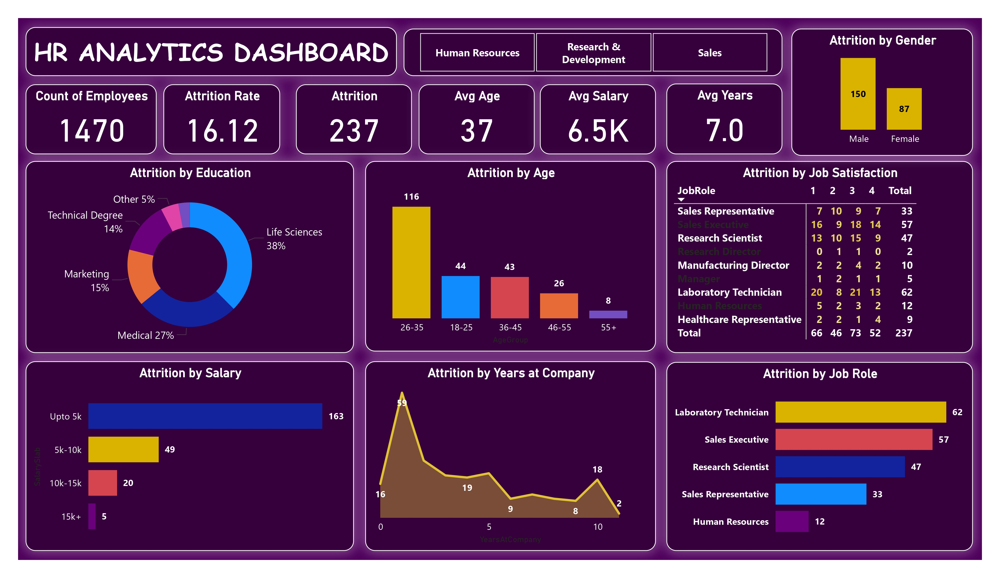

# 📊 HR Analytics Dashboard – Power BI

---

## 📌 Introduction
- The HR Analytics Dashboard is built to analyze employee attrition and key workforce metrics using Power BI.
- It helps HR teams and business leaders identify trends, understand employee behavior, and take data-driven actions to improve retention.
- The dashboard converts raw HR data into meaningful and actionable insights.

## 📈 Key Insights from the Dashboard

### 👥 Workforce Overview
- Total Employees: 1,470  
- Attrition Count: 237  
- Attrition Rate: 16.12%  
- Average Age: 37  
- Average Salary: 6.5K  
- Average Years at Company: 7  

These KPIs provide a snapshot of the overall workforce.  
They help identify the scale of attrition and employee demographics.  
This section sets the context for deeper analysis.

---

### 🎓 Attrition by Education
Employees from **Life Sciences and Medical backgrounds** show the highest attrition.  
Technical and Marketing backgrounds follow at moderate levels.  
Education-wise analysis helps HR tailor retention strategies for specific talent pools.

---

### 🎂 Attrition by Age Group
The **26–35 age group** has the highest attrition rate.  
Younger professionals tend to switch jobs more frequently for growth opportunities.  
Attrition decreases significantly with increasing age.

---

### 😊 Attrition by Job Satisfaction
Employees with **lower job satisfaction ratings** show higher attrition across roles.  
This highlights the importance of engagement, recognition, and work culture.  
Improving satisfaction can directly impact retention.

---

### 💼 Attrition by Job Role
Roles such as **Laboratory Technician, Sales Executive, and Research Scientist** face the highest attrition.  
These roles may experience higher workload or competitive job markets.  
Targeted role-based retention plans can reduce turnover.

---

### 💰 Attrition by Salary Slab
Employees earning **up to 5K** experience the highest attrition.  
Attrition decreases as salary increases.  
Compensation plays a crucial role in employee retention.

---

### 🕒 Attrition by Years at Company
Employees with **0–5 years of tenure** show the highest attrition.  
Longer tenure correlates with higher stability and loyalty.  
Early employee engagement is key to reducing attrition.

---

### 🚻 Attrition by Gender
Attrition is higher among **male employees** compared to females.  
This insight can help HR analyze role distribution and work-life balance factors.  
Gender-based trends support inclusive HR policies.

---

## ✅ Conclusion

This HR Analytics Dashboard demonstrates how **Power BI can uncover critical workforce trends**.  
By analyzing attrition across multiple dimensions, organizations can identify risk areas early.  
The dashboard supports smarter, data-driven HR decisions.

---